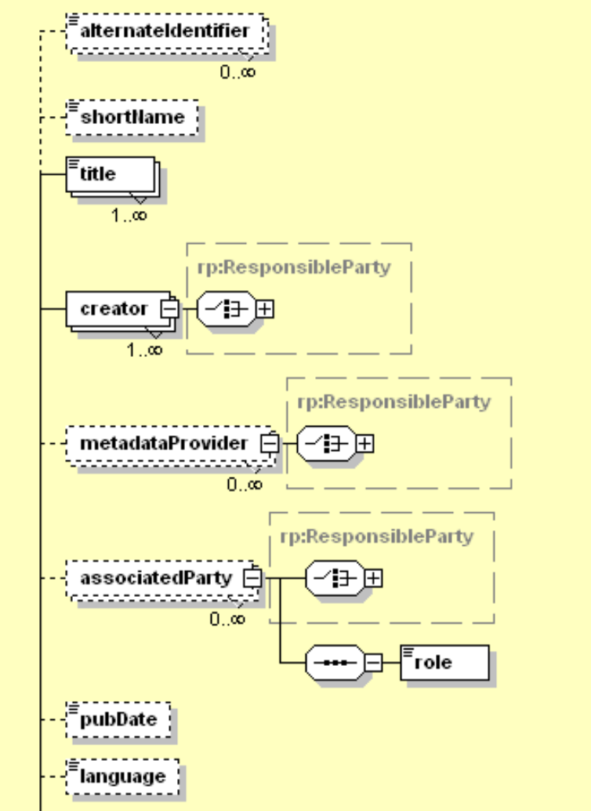

```{r setup, include=FALSE}
knitr::opts_chunk$set(echo = TRUE)
```

# Learning Objectives

In this tutorial we will:

* Learn what structured metadata is and how it can be used
* Learn how to create structured metadata using the `eml` package

# Introduction

Metadata is data about data. Many scientists work with metadata every day without realizing it.
Unstructured README documents, documents containing column definitions and units, tables of sampling
locations - these are all metadata. To be more specific, metadata describes the who-what-where-when-
why-how of a dataset. It captures broad information like the title of a dataset or a description
of methods, in addition to very specific information, such as file checksums or definitions for
column names in tabular data.

Let's walk through a some broad metadata guidelines and best practices [here](http://training.arcticdata.io/materials/arctic-data-center-training/03-best-practices-data-metadata.pdf)

# Metadata Standards

While some metadata is better than none, creating **structured** metadata according to a metadata
standard has a number of benefits. Here are a few:

* Machine readable
* Semantically consistent
* 
  
A metadata standard is a defined structure that allows information
about a dataset to be understood in a semantically consistent way. Three common metadata standards used
in the environmental science community are:

* [ISO 19115](http://www.iso.org/iso/en/CatalogueDetailPage.CatalogueDetail?CSNUMBER=26020)
* [Darwin Core](http://rs.tdwg.org/dwc/index.htm)
* [EML](https://knb.ecoinformatics.org/external//emlparser/docs/eml-2.1.1/index.html)

Although some metadata standards can be impelemented in other formats, it is most commonly implemented
using XML.

Here is an example of the beginning of an EML metadata document looks like:

```
  <dataset>
    <title>Estimate of total Alaskan salmon abundance by region, 2000-2015</title>
    <creator>
      <individualName>
        <givenName>Jeanette</givenName>
        <surName>Clark</surName>
      </individualName>
      <organizationName>National Center for Ecological Analysis and Synthesis</organizationName>
      <electronicMailAddress>jclark@nceas.ucsb.edu</electronicMailAddress>
      <userId directory="https://orcid.org">https://orcid.org/0000-0003-4703-1974</userId>
    </creator>
    <creator>
      <individualName>
        <givenName>Robyn</givenName>
        <surName>Thiessen-Bock</surName>
      </individualName>
    </creator>
  ...
```

We can see some elements in this that are clearly good information to have about a dataset - including
the title of the dataset and who created it. Note that each piece of metadata is contained within XML
tags that have intuitive names - like `creator`.

A metadata standard has a schema which specifies definitions of each of these tags and how they
are organized. Certain elements are required for all datasets while others are optional. Elements
can also be nested, and certain child elements may be required if a parent element is present.

Here is an image showing part of the EML schema for the `dataset` element. Child elements with dotted
lines are optional, whlie boxes with solid lines are required.




# Creating Metadata in R

## A minimal example

First install the `EML` package using `install.packages("EML")`

```{r}
library(EML)
```

The EML package relies on named list structures to generate name-value pairs for elements.

To start let's create the `individualName` element, and save it as an object called `me`. According to the [schema](https://knb.ecoinformatics.org/emlparser/docs/eml-2.1.1/eml-party.png) `individualName` has a required child element of `surName`, and optional `givenName` and `salutation`.

```{r}
me <- list(individualName = list(givenName = "Jeanette", surName = "Clark"))
me
```

This looks fairly confusing, and if you aren't intimitely familiar with the EML schema, you are probably feeling
a little intimidated. Luckily the `EML` package has a set of helper list constructor functions which tell you
what child elements can be used in a parent element.

When used with the R autocomplete functionality, the whole process gets a lot easier!

```{r}
me <- eml$individualName(givenName = "Jeanette", surName = "Clark")
```

We can then use this object, which represents the `individualName` element, and insert it into a larger EML document.

```{r}
doc <- list(packageId = "dataset-1", system = "local",
            dataset = eml$dataset(title = "A minimial valid EML dataset",
                                  creator = eml$creator(individualName = me),
                                  contact = eml$contact(individualName = me)))
```

You may have noticed that within R, there is nothing stopping you from inserting arbitrary elements
into your EML document. A critical step to creating EML is validating your EML document against the schema. 
In R this can be done using the `eml_validate` function.

```{r}
eml_validate(doc)
```

We can also write our EML using `write_eml`.

```{r}
write_eml(doc, "files/simple_example.xml")
```

Here is what the written file looks like:

```
<?xml version="1.0" encoding="UTF-8"?>
<eml:eml xmlns:eml="eml://ecoinformatics.org/eml-2.1.1" xmlns:xsi="http://www.w3.org/2001/XMLSchema-instance" xmlns:stmml="http://www.xml-cml.org/schema/stmml-1.1" packageId="id" system="system" xsi:schemaLocation="eml://ecoinformatics.org/eml-2.1.1/ eml.xsd">
  <dataset>
    <title>A minimial valid EML dataset</title>
    <creator>
      <individualName>
        <givenName>Jeanette</givenName>
        <surName>Clark</surName>
      </individualName>
    </creator>
    <contact>
      <individualName>
        <givenName>Jeanette</givenName>
        <surName>Clark</surName>
      </individualName>
    </contact>
  </dataset>
</eml:eml>
```


## Validation Errors

One of the hardest parts about creating EML in R is diagnosing validation errors. I won't get into 
too much detail, but here is a simple example. Note that I've swapped out the `eml$dataset` helper 
in favor of using the more generic `list`. The `eml$...` family of helpers can help prevent validation errors, 
since they have a set list of arguments which are allowed.

```{r}
doc <- list(packageId = "dataset-1", system = "local",
            dataset = list(title = "A minimial valid EML dataset",
                                  creator = eml$creator(individualName = me),
                                  contact = eml$contact(individualName = me),
                                  arbitrary = "making up stuff"))

eml_validate(doc)
```

This error essentially says that the element `arbitrary` is not expected, and gives you a hint of some elements that the
parser did expect. Validation errors can be tricky, especially when there are lots of them. Validate early and often!

## A more complete example

As you might imagine, creating a complete metadata record like what is shown on [this page](https://knb.ecoinformatics.org/view/doi:10.5063/F1NC5ZGW) would be pretty tedious if we did it just using
the generic `list` or `eml$...` helpers.

The `EML` package has a set of higher level `set_...` helpers that create some of the more complex elements.

To demonstrate the use of these we are going to create an EML document that contains the following information:

* title
* creator and contact
* abstract
* methods
* geographic and temporal coverage
* description of a tabular data file

We will edit these elements using a mix of helpers and generic techniques.

### Title, creator, contact

To start, lets create a basic EML skeleton using our minimal example above:

```{r}
me <- eml$individualName(givenName = "Jeanette", surName = "Clark")

doc <- list(packageId = "dataset-1", system = "local",
            dataset = eml$dataset(title = "A minimial valid EML dataset",
                                  creator = eml$creator(individualName = me),
                                  contact = eml$contact(individualName = me)))
```

Because we have used the `eml$dataset` helper, all of the possible sub-elements have been populated in our EML document, allowing us to easily access and edit them using R autocomplete.

### Abstract

We can use this to dive down into sub-elements and edit them. Let's do the abstract. This is a simple element
so we can just assign the value of the `abstract` to a character string.

```{r}
doc$dataset$abstract <- "A brief but comprehensive description of the who, what, where, when, why, and how of my dataset."
```

### Methods

We can use the `set_methods` function to parse a markdown (or word) document and insert it into the methods section.
This helper is especially nice because it preserves formatting.

```{r}
doc$dataset$methods <- set_methods("files/methods.md")
doc$dataset$methods
```

### Coverage

The geographic and temporal coverage can be set using `set_coverage`.

```{r}
doc$dataset$coverage <- set_coverage(beginDate = 2001,
                                     endDate = 2010,
                                     geographicDescription = "Alaska, United States",
                                     westBoundingCoordinate = -179.9,
                                     eastBoundingCoordinate = -120,
                                     northBoundingCoordinate = 75,
                                     southBoundingCoordinate = 55)
```

### Tabluar Data File

Information about data files (or `entity` level information) can be added in child elements of the `dataset`
element. Here we will use the element `dataTable` (other options include `spatialVector`, `spatialRaster`, and `otherEntity`).

First, some high level information.

```{r}
doc$dataset$dataTable <- eml$dataTable(entityName = "files/my-data.csv",
                                       entityDescription = "Temperature data from in-situ loggers")
```

We can use the `set_physical` helper to set more specific information about the file, like its size, delimiter, and checksum. This function automatically detects fundamental characteristics about the file if you give it a path to your file on your system.

```{r}
doc$dataset$dataTable$physical <- set_physical("files/my-data.csv")
```

Finally, perhaps the most important part of metadata, but frequently the most difficult to document in a metadata standard,
attribute level information. This is information about columns within data tables, critical to understanding what kind of information is actually in the table!

The `set_attributes` function will take a `data.frame` that gives required attribute information. This `data.frame` contains rows corresponding to column names (or attributes) in the dataset, and columns:

* attributeName (any text)
* attributeDefinition (any text)
* unit (required for numeric data)
* numberType (required for numeric data, one of: real, natural, whole, integer)
* formatString (required for dateTime data)
* definition (required for textDomain data)

Two other sub-elements, the `domain` and `measurementScale`, can be inferred from the `col_classes` argument to `set_attributes`.

Let's create our attributes `data.frame`.

```{r}
atts <- data.frame(attributeName = c("time", "temperature", "site"),
                   attributeDefinition = c("time of measurement", "measured temperature in degrees Celsius", "site identifier"),
                   unit = c(NA, "celsius", NA),
                   numberType = c(NA, "real", NA),
                   formatString = c("HH:MM:SS", NA, NA),
                   definition = c(NA, NA, "site identifier"))
```

We will then use this in our `set_attributes` function, along with the `col_classes` argument, to generate a complete `attributeList`.

```{r}
doc$dataset$dataTable$attributeList <- set_attributes(attributes = atts,
                                                      col_classes = c("Date", "numeric", "character"))
```

As you might imagine, this can get VERY tedious with wide data tables. The function `shiny_attributes` calls an interactive table that can not only automatically detect and attempt to fill in attribute information from a `data.frame`, but also helps with on the fly validation.

You probably need the `shiny` package installed for this to work.

```{r, eval = F}
atts_shiny <- shiny_attributes(data = read.csv("files/my-data.csv"))
```

This produces a `data.frame` that you can insert into `set_attributes` as above.

### Validating and writing the file

Finally, we need to of course validate and write our file.

```{r}
eml_validate(doc)
```

```{r}
write_eml(doc, "files/complex_example.xml")
```

